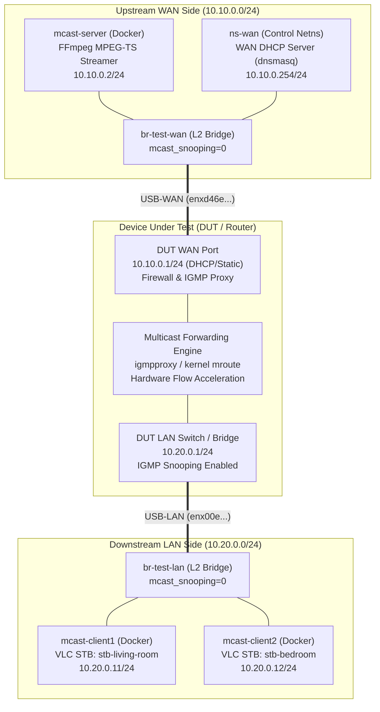
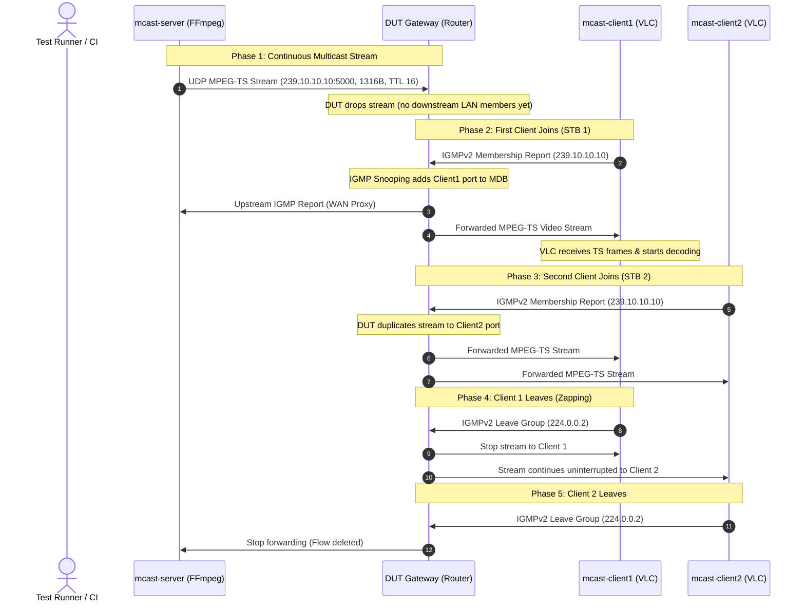

# Real IPTV Multicast Integration Lab

A production-grade, reproducible multicast test environment designed to validate **real-world IPTV streaming** through physical routers (DUT) or self-contained virtual simulations.

Unlike synthetic socket tests, this lab uses **real application/protocol stacks**:
* **Media Server**: Containerized **FFmpeg** streaming 1080p MPEG-TS over UDP Multicast (`239.10.10.10:5000`).
* **STB Clients**: Containerized **VLC (cvlc)** clients invoking native kernel `IP_ADD_MEMBERSHIP` socket options to generate standard IGMPv2 Report signaling.
* **Network Isolation**: Containers run with `--network none` and attach directly to L2 test bridges via dedicated `veth` pairs without Docker NAT or IP masquerading.

---

## Architecture Topology



---

## Packet Flow & Protocol Sequence



---

## Directory Structure

```text
iptv_multicast_integration_lab/
├── config.env.example        # Reference configuration with strict quoting & documentation
├── config.env                # Local host-specific configuration
├── Dockerfile.media          # Ubuntu 24.04 image with FFmpeg, VLC, iproute2
├── captures/                 # Timestamped PCAP evidence files (*.pcap)
├── logs/                     # Background daemon logs (server.log, client_*.log)
├── media/                    # MPEG-TS video assets (sample_1080p_8mbps.ts)
├── state/                    # Runtime state (PIDs, topology_state.env)
├── docs/
│   ├── SHELL_STYLE.md        # Strict mode & safety guidelines
│   └── TEST_PLAN.md          # Test plan & compliance matrix
└── scripts/
    ├── lib/
    │   └── common.sh         # Core framework library (logging, docker, safety, virtual DUT)
    ├── build_image.sh        # Builds multicast-media-tools:latest Docker image
    ├── generate_media.sh     # Generates deterministic 1080p 8Mbps MPEG-TS sample
    ├── setup.sh              # Topology setup (--physical or --virtual)
    ├── cleanup.sh            # Idempotent cleanup of containers, veths, bridges
    ├── capture.sh            # Packet capture manager (start | stop | status)
    ├── show_state.sh         # Displays bridges, containers, routes, groups, daemons
    ├── diagnose.sh           # Non-destructive pre-flight check of host, NICs, tools
    ├── start_server.sh       # FFmpeg streamer manager (run | start | stop | status)
    ├── start_client.sh       # VLC STB client manager (run | start | stop | status)
    ├── scenario.sh           # Multi-phase automated smoke scenario
    ├── verify_capture.sh     # Automated PCAP verification & latency analysis
    └── view_stream_gui.sh    # Desktop GUI player (VLC/FFplay) on Ubuntu host with auto routing
```

---

## Prerequisites

Install host dependencies:

```bash
sudo apt update
sudo apt install -y docker.io iproute2 ethtool tshark tcpdump ffmpeg util-linux usbutils
sudo systemctl enable --now docker
```

---

## Quick Start Guide

### Step 1: Configure Environment
Copy configuration and set your physical USB adapter names:

```bash
cp config.env.example config.env
nano config.env
```

Set:
```bash
WAN_IF="enxd46e0e0c65e1"   # Connected to DUT WAN port
LAN_IF="enx00e04c88293c"   # Connected to DUT LAN port
```

---

### Step 2: Build Image & Generate Media Asset
```bash
# 1. Build the Docker container image:
./scripts/build_image.sh

# 2. Generate the deterministic 1080p 8Mbps test video:
./scripts/generate_media.sh
```

---

### Step 3: Setup Topology

#### Option A: Physical DUT Mode (Testing with Real Hardware Router)
```bash
sudo ./scripts/setup.sh --physical
```

#### Option B: Virtual Simulation Mode (Self-contained, No Hardware Required)
```bash
sudo ./scripts/setup.sh --virtual
```

#### Option C: Server-Only Mode (Testing with External VLC / Windows Client)
```bash
sudo ./scripts/setup.sh --physical --server-only
# Short syntax: sudo ./scripts/setup.sh -p -s
```
Deploys `br-test-wan`, `br-test-lan`, WAN DHCP server, and Media Server, then **automatically starts streaming** while skipping internal STB client containers. Add `--no-stream` if you want to deploy the server container without auto-starting the stream.

Verify setup status:
```bash
./scripts/show_state.sh
```

---

### Step 4: Run Automated End-to-End Scenario
Run the complete multi-phase qualification scenario in one command:

```bash
sudo ./scripts/scenario.sh
```

This automatically:
1. Starts packet capture on the LAN side.
2. Launches the background FFmpeg MPEG-TS multicast stream.
3. Launches VLC Client 1 (sends IGMPv2 Join and receives video).
4. Launches VLC Client 2 (verifies multi-client stream replication).
5. Stops Client 1 (verifies Leave signaling and Client 2 continuation).
6. Stops Client 2 and server stream.
7. Analyzes PCAP evidence and outputs verification results with Join-to-first-data latency.

---

### Step 5: Testing with External Windows Client (VLC on Windows)

When testing real-world IPTV playback on a separate Windows PC connected to the router:

1. **Deploy Lab in Server-Only Mode**:
   ```bash
   sudo ./scripts/setup.sh --physical --server-only
   ```
2. **Monitor Traffic in Real Time on Linux**:
   ```bash
   sudo tcpdump -i br-test-lan -nn "igmp or (udp and port 5000)"
   ```
3. **Connect Windows PC**:
   - Plug an Ethernet cable from the Windows PC into a spare LAN port on the Router (DUT).
   - Ensure Windows receives an IP address in the router's LAN subnet.
4. **Configure Windows Firewall (Required)**:
   - Open **PowerShell as Administrator** on Windows and run:
     ```powershell
     New-NetFirewallRule -DisplayName "IPTV Multicast Port 5000" -Direction Inbound -LocalPort 5000 -Protocol UDP -Action Allow
     ```
5. **Open Stream in VLC for Windows**:
   - Open VLC Media Player $\rightarrow$ Press `Ctrl + N` (or `Media` $\rightarrow$ `Open Network Stream...`).
   - Enter the URL:
     ```text
     udp://@239.10.10.10:5000
     ```
     *(Note: The `@` symbol is mandatory in VLC to listen for incoming multicast).*
   - Click **Play**. Video will stream smoothly to your Windows screen!

---

### Step 6: Testing with Ubuntu Desktop GUI Player

To watch the live multicast video directly on the Ubuntu desktop screen:

```bash
# Watch stream forwarded through DUT Router on LAN side (Default):
./scripts/view_stream_gui.sh lan

# Or watch stream directly from Media Server on WAN side (Bypass Router):
./scripts/view_stream_gui.sh wan
```
* `view_stream_gui.sh` temporarily configures host multicast routing (`224.0.0.0/4`), launches VLC / FFplay GUI, and automatically cleans up routing tables when the player window is closed.

---

### Step 7: Interactive CLI Client Testing (Optional)

In separate terminals:

```bash
# Terminal 1: Watch packet capture
sudo ./scripts/capture.sh start lan

# Terminal 2: Stream video from server
./scripts/start_server.sh run

# Terminal 3: Watch client 1 receive stream
./scripts/start_client.sh 1 run

# Terminal 4: Inspect group memberships
./scripts/show_state.sh
```

---

### Step 8: Verify Captured Evidence

```bash
./scripts/verify_capture.sh full
```

Output example:
```text
==============================================================================
                 IPTV MULTICAST LAB - VERIFICATION REPORT                      
==============================================================================
Capture File:     captures/lan_20260904_125128.pcap
Multicast Group:  239.10.10.10 (UDP Port 5000)
------------------------------------------------------------------------------
  Metric / Check                      | Observed     | Result    
------------------------------------------------------------------------------
  IGMPv2 Membership Reports (Join)    | 4            | PASS      
  MPEG-TS Multicast Packets           | 9885         | PASS      
  Join-to-First-Data Latency          | 68.342 ms    | PASS      
  IGMPv2 Leave Messages               | 1            | PASS      
==============================================================================
OVERALL RESULT: PASS (Real video streaming and IGMP signaling verified)
```

---

### Step 9: Cleanup

```bash
sudo ./scripts/cleanup.sh
```

---

## DUT Configuration Requirements

To ensure the router forwards multicast from WAN to LAN:
1. **Firewall (WAN Zone)**:
   * Allow incoming IGMP: `proto igmp accept`
   * Allow incoming UDP Multicast: `ip daddr 224.0.0.0/4 udp dport 5000 accept`
   * Allow forwarding from WAN to LAN for `224.0.0.0/4`.
2. **IGMP Proxy (`/etc/igmpproxy.conf`)**:
   ```conf
   phyint eth1.1 upstream ratelimit 0 threshold 1
          altnet 10.10.0.0/24

   phyint br-lan downstream ratelimit 0 threshold 1
   ```
3. **IGMP Snooping on LAN Bridge**:
   * Enable snooping: `echo 1 > /sys/devices/virtual/net/br-lan/bridge/mcast_snooping`
   * Enable querier (optional): `echo 1 > /sys/devices/virtual/net/br-lan/bridge/multicast_querier`

---

## Wireshark / TShark Display Filters

```text
# All IGMP Control Messages
igmp

# IGMPv2 Membership Report (Join)
igmp.type == 0x16

# IGMPv2 Leave Group
igmp.type == 0x17

# Specific Group Traffic
igmp.maddr == 239.10.10.10

# MPEG-TS UDP Multicast Data Packets
ip.dst == 239.10.10.10 && udp.dstport == 5000
```

---

## Troubleshooting & FAQ

### 1. VLC on Windows connects but displays a black screen / buffers indefinitely
* **Windows Defender Firewall**: Windows blocks inbound UDP multicast packets by default. Run this in PowerShell (Admin):
  ```powershell
  New-NetFirewallRule -DisplayName "IPTV Multicast Port 5000" -Direction Inbound -LocalPort 5000 -Protocol UDP -Action Allow
  ```
* **Use Wired Ethernet**: Do not use Wi-Fi for testing multicast on Windows. Home Wi-Fi routers frequently drop or filter out wireless multicast packets to prevent Wi-Fi bandwidth saturation.
* **Confirm URL syntax**: Ensure the URL begins with `udp://@` (the `@` symbol instructs VLC to bind the local port and join the multicast group).

### 2. VLC GUI on Ubuntu doesn't receive stream
* Ubuntu directs multicast packets to its default route (usually Wi-Fi `wlp3s0`). Always use the automated launcher:
  ```bash
  ./scripts/view_stream_gui.sh lan
  ```
  This script safely routes `224.0.0.0/4` through `br-test-lan` and restores your original routing table when closed.

### 3. Server-Only mode doesn't stream
* Run `./scripts/show_state.sh` to confirm `mcast-server` status is `STREAMING`.
* If you passed `--no-stream`, start the stream manually with:
  ```bash
  ./scripts/start_server.sh start
  ```

