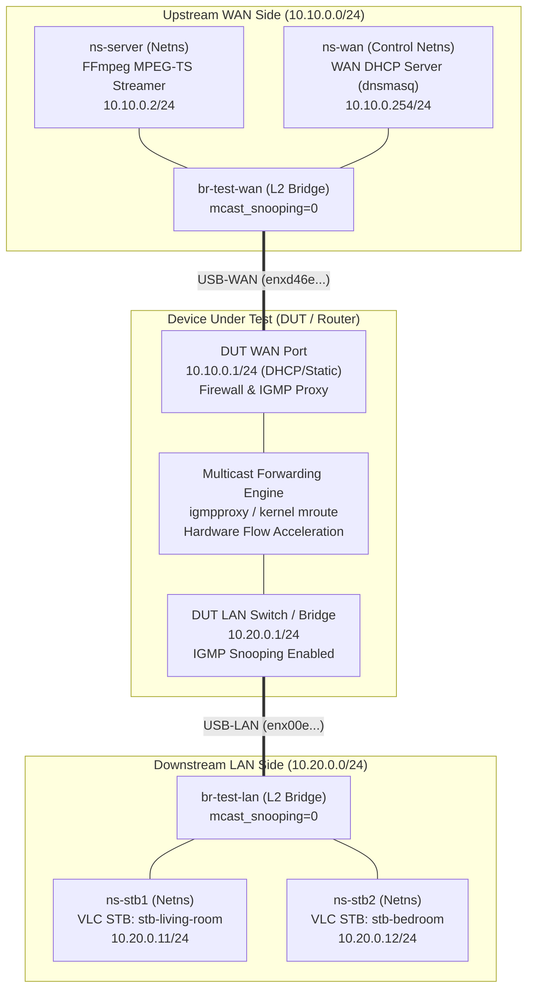
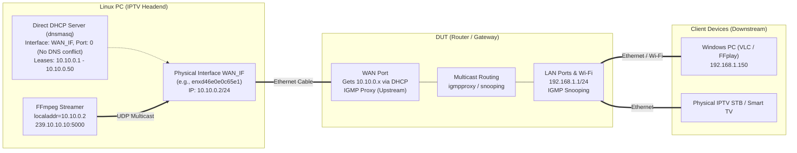
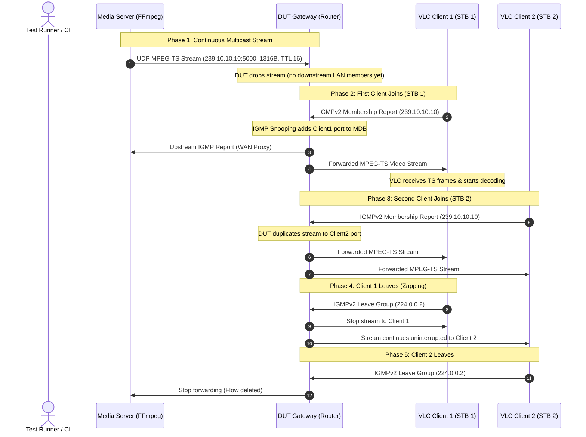

# Real IPTV Multicast Integration Lab

A production-grade, reproducible multicast test environment designed to validate **real-world IPTV streaming** through physical routers (DUT) or self-contained virtual simulations.

Unlike synthetic socket tests, this lab uses **real application/protocol stacks**:
* **Media Server**: **FFmpeg** streaming 1080p MPEG-TS over UDP Multicast (`239.10.10.10:5000`).
* **STB Clients**: **VLC (cvlc)** clients invoking native kernel `IP_ADD_MEMBERSHIP` socket options to generate standard IGMPv2 Report signaling.
* **Network Flexibility**: Native Linux Network Namespaces (`ip netns`), L2 test bridges, or direct standalone host streaming without topology bridges. Zero Docker dependency.

---

## Deployment Modes Matrix

| Mode | Command | Bridges | Namespaces | Physical NICs | Typical Use Case |
|---|---|---|---|---|---|
| **Standalone WAN Server** *(Zero Topology)* | `sudo ./scripts/start_wan_server.sh run` | None | None | `WAN_IF` only | Linux PC acts as IPTV headend directly on Router WAN port; clients test on Router LAN/Wi-Fi |
| **WAN-Only Namespace** | `sudo ./scripts/setup.sh --wan-only` | `br-test-wan` | `ns-server`, `ns-wan` | `WAN_IF` only | Isolated IPTV headend with network namespace & WAN DHCP |
| **Physical Server-Only** | `sudo ./scripts/setup.sh -p -s` | `br-test-wan`, `br-test-lan` | `ns-server`, `ns-wan` | `WAN_IF` & `LAN_IF` | Router in the middle; external physical/Windows client on LAN bridge |
| **Full Physical DUT** | `sudo ./scripts/setup.sh --physical` | `br-test-wan`, `br-test-lan` | `ns-server`, `ns-stb1,2`, `ns-wan` | `WAN_IF` & `LAN_IF` | Full automated physical qualification test with internal STB namespaces |
| **Virtual Simulation** | `sudo ./scripts/setup.sh --virtual` | `br-test-wan`, `br-test-lan` | `ns-server`, `ns-dut`, `ns-stb1,2` | None | Local development, debugging, and headless CI pipelines |

---

## Architecture Topologies

### Topology 1: Full End-to-End Qualification Lab (Physical / Virtual)



### Topology 2: Standalone Zero-Topology WAN Server (Direct Host Headend)



---

## Packet Flow & Protocol Sequence



---

## Directory & Script Structure

```text
iptv_multicast_integration_lab/
├── config.env.example        # Reference configuration template
├── config.env                # Local host-specific configuration
├── config/
│   └── pimd.conf             # PIM-SM/SSM daemon configuration template
├── captures/                 # Timestamped PCAP evidence files (*.pcap)
├── logs/                     # Daemon logs (server.log, client_*.log, dnsmasq-*.log)
├── media/                    # MPEG-TS video assets (sample_1080p_8mbps.ts)
├── state/                    # Runtime state (PIDs, leases, topology_state.env)
├── docs/
│   ├── SHELL_STYLE.md        # Strict mode & safety guidelines
│   └── TEST_PLAN.md          # Test plan & compliance matrix
├── tools/                    # Standalone Python 3 Multicast & IGMP tools
│   ├── igmp_client.py        # High-performance multi-group join/leave/churn client
│   ├── igmp_query.py         # Raw AF_PACKET IGMP query injector (General & Specific)
│   ├── mcast_sender.py       # High-precision UDP multicast transmitter with sequence tagging
│   └── mcast_receiver.py     # UDP multicast receiver with sequence & loss analysis
└── scripts/
    ├── lib/
    │   ├── common.sh         # Core framework library (logging, netns, safety)
    │   └── udhcpc.script     # BusyBox udhcpc event script for namespace LAN DHCP
    ├── install_deps.sh       # One-touch host dependency installer (apt-based)
    ├── client_dhcp.sh        # LAN DHCP client manager for STB namespaces (request | daemon | status | release)
    ├── start_wan_server.sh   # Standalone WAN IPTV server (Zero Topology, host-direct)
    ├── start_server.sh       # Streamer manager (--direct host mode or --netns mode)
    ├── setup.sh              # Topology setup (--physical, --virtual, --wan-only, --server-only, --dhcp, --static)
    ├── cleanup.sh            # Idempotent cleanup of namespaces, veths, bridges, direct daemons
    ├── show_state.sh         # Displays runtime state, bridges, namespaces, groups, DHCP leases
    ├── capture.sh            # Packet capture manager (start | stop | status)
    ├── generate_media.sh     # Generates deterministic 1080p 8Mbps MPEG-TS sample
    ├── diagnose.sh           # Non-destructive pre-flight check of host, NICs, tools
    ├── start_client.sh       # VLC STB client manager (run | start | stop | status)
    ├── scenario.sh           # Multi-phase automated smoke scenario
    ├── verify_capture.sh     # Automated PCAP verification & latency analysis
    ├── view_stream_gui.sh    # Desktop GUI player (VLC/FFplay) on Ubuntu host with auto routing
    ├── benchmark_suite.sh    # Comprehensive benchmark suite (scale, churn, stress, loss)
    └── dut_collector.sh      # Remote router state and multicast diagnostics collector
```

---

## Prerequisites

Install host dependencies with one command:

```bash
sudo ./scripts/install_deps.sh
```

Or manually install packages via `apt`:
```bash
sudo apt update
sudo apt install -y iproute2 ethtool tshark tcpdump ffmpeg vlc udhcpc dnsmasq python3 util-linux usbutils
```

---

## Quick Start Guide

### Step 1: Configure Environment

Copy configuration and specify your physical Ethernet adapter(s):

```bash
cp config.env.example config.env
nano config.env
```

Set:
```bash
WAN_IF="enxd46e0e0c65e1"   # Connected to DUT WAN port
LAN_IF="enx00e04c88293c"   # Connected to DUT LAN port (only needed if using LAN bridge)
```

---

### Step 2: Generate Media Asset

```bash
./scripts/generate_media.sh
```

---

### Step 3: Choose Your Running Mode

#### Mode 1: Standalone WAN IPTV Server (Zero Topology - Recommended for Router WAN Testing)
Use this when you only have **one cable** connecting the Linux PC's `WAN_IF` to the router's WAN port, and test clients (Windows PC, physical STBs, phones) are connected directly to the router's LAN ports or Wi-Fi:

```bash
# Foreground interactive streaming (displays live FFmpeg bitrate/fps stats):
sudo ./scripts/start_wan_server.sh run
# Or: sudo ./scripts/start_server.sh --direct run

# Or background daemon mode:
sudo ./scripts/start_wan_server.sh start
./scripts/start_wan_server.sh status
sudo ./scripts/start_wan_server.sh stop
```
* **No test bridges or namespaces needed.**
* Automatically unmanages `WAN_IF` from NetworkManager and assigns `10.10.0.2/24`.
* Automatically runs an isolated WAN DHCP server (`dnsmasq`) bound strictly to `WAN_IF` (`port=0`, no DNS listener conflict) to provide an IP to the router's WAN port.
* Directly streams FFmpeg MPEG-TS out `WAN_IF`.

#### Mode 2: WAN-Only Namespace Topology Mode
Use this if you prefer network namespace isolation for the media server, but only have `WAN_IF` connected (no `LAN_IF` or LAN bridge):

```bash
sudo ./scripts/setup.sh --wan-only
# Short syntax: sudo ./scripts/setup.sh -w
```
Deploys `br-test-wan`, `WAN_NS` (DHCP), and `ns-server` namespace on `WAN_IF`, skipping all LAN bridges and client namespaces.

#### Mode 3: Server-Only Physical Topology Mode
```bash
sudo ./scripts/setup.sh --physical --server-only
# Short syntax: sudo ./scripts/setup.sh -p -s
```
Deploys both `br-test-wan` and `br-test-lan` and starts streaming, but skips client namespaces so you can connect external test devices to `LAN_IF`.

#### Mode 4: Full Physical DUT Mode (Automated End-to-End)
```bash
# Dynamic DHCP Mode: Clients obtain IP from DUT LAN DHCP server (Default if CLIENT_IP_MODE=dhcp)
sudo ./scripts/setup.sh --physical --dhcp

# Static Mode: Clients use static IPs from config.env (10.20.0.11/24, 10.20.0.12/24)
sudo ./scripts/setup.sh --physical --static
```
Deploys both bridges, starts media server streaming in `ns-server`, and launches internal STB client namespaces (`ns-stb1`, `ns-stb2`). When running in DHCP mode, clients automatically send DHCP Discover requests with:
* **Option 12 (Host Name)**: `stb-living-room` and `stb-bedroom`
* **Option 60 (Vendor Class Identifier)**: `IPTV_STB`

#### Mode 5: Virtual Simulation Mode (No Hardware Required)
```bash
sudo ./scripts/setup.sh --virtual
```

Verify state anytime with:
```bash
./scripts/show_state.sh
```

---

### Step 4: LAN Client DHCP Management (`client_dhcp.sh`)

You can inspect, request, or renew DHCP leases for namespace STB clients at any time:

```bash
# Check current lease status, IP, gateway, and MAC for all clients:
./scripts/client_dhcp.sh status all

# Request a one-shot DHCP lease for client 1 or all clients:
sudo ./scripts/client_dhcp.sh request all

# Start background udhcpc daemons to continuously maintain/renew leases:
sudo ./scripts/client_dhcp.sh daemon all

# Release lease and flush IP:
sudo ./scripts/client_dhcp.sh release all
```

---

### Step 5: Testing with External Windows Client (VLC / FFplay)

When testing IPTV playback on a separate Windows PC connected to the router's LAN port:

1. **Start the IPTV Server on Linux**:
   ```bash
   sudo ./scripts/start_wan_server.sh start
   ```
2. **Connect Windows PC**:
   - Plug an Ethernet cable from the Windows PC into a LAN port on the Router (DUT).
   - Ensure Windows receives an IP in the router's LAN subnet (e.g. `192.168.1.150`).
3. **Configure Windows Defender Firewall (Required)**:
   Open **PowerShell as Administrator** on Windows and allow inbound UDP port 5000:
   ```powershell
   New-NetFirewallRule -DisplayName "IPTV Multicast Port 5000" -Direction Inbound -LocalPort 5000 -Protocol UDP -Action Allow
   ```
4. **Select Network Interface (Avoid Wi-Fi vs Ethernet Routing Conflicts)**:
   When Windows has both Wi-Fi and Ethernet active, Windows may route multicast/IGMP requests over Wi-Fi instead of the Ethernet adapter connected to the router. Use any of the following methods:

   * **Method A: Windows Multicast Route (Recommended - Universal for all apps)**:
     Open **Command Prompt as Administrator** on Windows:
     ```cmd
     route add 224.0.0.0 mask 240.0.0.0 192.168.1.150 metric 1
     ```
     *(This ensures all applications—VLC, FFplay, and browser players—send IGMP Joins and receive video via Ethernet. To remove later: `route delete 224.0.0.0`).*

     Then in VLC, simply open:
     ```text
     udp://@239.10.10.10:5000
     ```

   * **Method B: VLC Command-Line Flag (`--mcast-intf`)**:
     Open PowerShell or CMD on Windows:
     ```powershell
     & "C:\Program Files\VideoLAN\VLC\vlc.exe" udp://@239.10.10.10:5000 --mcast-intf 192.168.1.150
     ```

   * **Method C: VLC GUI Preferences**:
     1. In VLC, go to **Tools** -> **Preferences** (`Ctrl + P`).
     2. In the bottom-left corner, select **All** under **Show settings**.
     3. Navigate to **Input / Codecs** -> **Access modules** -> **UDP**.
     4. In **Multicast output interface**, enter: `192.168.1.150`.
     5. Click **Save** and restart VLC.
     6. Open URL: `udp://@239.10.10.10:5000`.

   * **Method D: Using FFplay (`localaddr`)**:
     ```powershell
     ffplay -i "udp://239.10.10.10:5000?localaddr=192.168.1.150"
     ```

---

### Step 6: Testing with Ubuntu Desktop GUI Player

To watch the live multicast video directly on the Ubuntu desktop:

```bash
# Watch stream forwarded through DUT Router on LAN side:
./scripts/view_stream_gui.sh lan

# Or watch stream directly from Media Server on WAN side (bypasses router):
./scripts/view_stream_gui.sh wan
```
* Automatically handles host multicast routing (`224.0.0.0/4`) and restores original tables upon exit.

---

### Step 7: Automated End-to-End Smoke Scenario

To run the complete automated qualification test (Join, stream validation, multi-client replication, Leave):

```bash
sudo ./scripts/scenario.sh
```

Inspect captured traffic and latency:
```bash
./scripts/verify_capture.sh full
```

Example report:
```text
==============================================================================
                 IPTV MULTICAST LAB - VERIFICATION REPORT                      
==============================================================================
Capture File:     captures/lan_20260904_125128.pcap
Multicast Group:  239.10.10.10 (UDP Port 5000)
------------------------------------------------------------------------------
  Metric / Check                      | Observed     | Result    
------------------------------------------------------------------------------
  IGMPv2 Membership Reports (Join)    | 4            | PASS      
  MPEG-TS Multicast Packets           | 9885         | PASS      
  Join-to-First-Data Latency          | 68.342 ms    | PASS      
  IGMPv2 Leave Messages               | 1            | PASS      
==============================================================================
OVERALL RESULT: PASS (Real video streaming and IGMP signaling verified)
```

---

### Step 8: Cleanup & Interface Restoration

To stop all streams, daemons, namespaces, and **automatically restore all physical interfaces (`WAN_IF`, `LAN_IF`) to UP state with DHCP**:

```bash
sudo ./scripts/cleanup.sh
# Explicit restore flag: sudo ./scripts/cleanup.sh --restore (or -r, --dhcp)
```
* Tears down test namespaces, bridges, veth pairs, and DHCP servers.
* Automatically detaches physical interfaces from test bridges and flushes test IPs (`10.10.0.x`).
* Brings physical links `UP`, restores NetworkManager management, and triggers DHCP to acquire IPs from whatever network they are connected to.

If you prefer to keep interfaces isolated and administratively `DOWN`:
```bash
sudo ./scripts/cleanup.sh --down
```

---

## DUT Router Configuration Requirements

To ensure the router forwards multicast from WAN to LAN:
1. **Firewall (WAN Zone)**:
   * Allow incoming IGMP: `proto igmp accept`
   * Allow incoming UDP Multicast: `ip daddr 224.0.0.0/4 udp dport 5000 accept`
   * Allow forwarding from WAN to LAN for `224.0.0.0/4`.
2. **IGMP Proxy (`/etc/igmpproxy.conf`)**:
   ```conf
   phyint eth1.1 upstream ratelimit 0 threshold 1
          altnet 10.10.0.0/24

   phyint br-lan downstream ratelimit 0 threshold 1
   ```
3. **IGMP Snooping on LAN Bridge**:
   * Enable snooping: `echo 1 > /sys/devices/virtual/net/br-lan/bridge/mcast_snooping`
   * Enable querier (optional): `echo 1 > /sys/devices/virtual/net/br-lan/bridge/multicast_querier`

---

## Wireshark / TShark Display Filters

```text
# All IGMP Control Messages
igmp

# IGMPv2 Membership Report (Join)
igmp.type == 0x16

# IGMPv2 Leave Group
igmp.type == 0x17

# Specific Group Traffic
igmp.maddr == 239.10.10.10

# MPEG-TS UDP Multicast Data Packets
ip.dst == 239.10.10.10 && udp.dstport == 5000
```

---

## Troubleshooting & FAQ

### 1. VLC on Windows connects but displays a black screen / buffers indefinitely
* **Windows Defender Firewall**: Windows blocks inbound UDP multicast packets by default. Run this in PowerShell (Admin):
  ```powershell
  New-NetFirewallRule -DisplayName "IPTV Multicast Port 5000" -Direction Inbound -LocalPort 5000 -Protocol UDP -Action Allow
  ```
* **Wi-Fi vs Ethernet Conflict**: If both Wi-Fi and Ethernet are connected, Windows routes IGMP out Wi-Fi. Add a static multicast route:
  ```cmd
  route add 224.0.0.0 mask 240.0.0.0 192.168.1.150 metric 1
  ```
* **Confirm URL syntax**: Ensure the URL begins with `udp://@` (the `@` symbol instructs VLC to listen on the local port and join the multicast group).

### 2. Router WAN does not obtain an IP address
* Ensure `ENABLE_WAN_DHCP="1"` in `config.env`.
* Run `./scripts/show_state.sh` or check active leases:
  - For standalone mode: `cat state/dnsmasq-direct.leases`
  - For namespace mode: `cat state/dnsmasq-wan.leases`
* Check the physical cable connection between `WAN_IF` and the router's WAN port.

### 3. VLC GUI on Ubuntu doesn't receive stream
* Ubuntu directs multicast packets to its default route (usually Wi-Fi `wlp3s0`). Always use the automated launcher:
  ```bash
  ./scripts/view_stream_gui.sh lan
  ```

### 4. How to generate video with different bitrates or resolutions?
* Modify `STREAM_BITRATE` or edit parameters in `scripts/generate_media.sh`:
  ```bash
  ./scripts/generate_media.sh
  ```

---

## Multicast Benchmark & RFC Verification Suite

This lab incorporates specialized benchmark tools and RFC compliance test harnesses to evaluate multicast routers, CPEs, and gateways (RFC 2236, RFC 3376, RFC 4541, RFC 4605).

### 1. Benchmark Scripts & Tools

| Script / Tool | Category | Description |
|---|---|---|
| [`./scripts/benchmark_suite.sh`](scripts/benchmark_suite.sh) | **Master Suite** | Master runner executing all benchmark tests and generating comprehensive report |
| [`./scripts/test_scale.sh`](scripts/test_scale.sh) | **Capacity Scale** | Joins N distinct groups (`239.100.1.1-32`); evaluates router snooping and table capacity |
| [`./scripts/test_churn.sh`](scripts/test_churn.sh) | **Rapid Churn** | Executes rapid Join/Leave cycles (e.g. 100ms) to evaluate control-plane stability |
| [`./scripts/test_query_stress.sh`](scripts/test_query_stress.sh) | **Query Stress** | Injects high-rate Group-Specific Queries (e.g. 250 qps) addressed to the multicast group |
| [`./scripts/test_packet_loss.sh`](scripts/test_packet_loss.sh) | **Packet Loss** | Generates sequence-tracked packets across multiple groups; verifies loss ratio |
| [`./scripts/test_foreign_querier.sh`](scripts/test_foreign_querier.sh) | **Querier Election** | Injects foreign LAN querier frames to evaluate querier election and port behavior |
| [`./scripts/dut_collector.sh`](scripts/dut_collector.sh) | **Diagnostics** | SSH/UART diagnostic collector for router multicast routes, snooping tables, and kernel status |
| [`./scripts/verify_capture.sh compliance`](scripts/verify_capture.sh) | **Traffic Audit** | Analyzes PCAP captures for ToS/DSCP, DF bit, join latency, and source MAC/IP |

### 2. Standalone Protocol Tools (`tools/`)

All protocol test tools in `tools/` are standalone Python 3 utilities utilizing the standard library (no pip dependencies):
* **`tools/igmp_client.py`**: High-performance IGMP client supporting range syntax (`239.100.1.1-32`), hold durations, rapid churn loops, and IGMPv3 SSM (`--sources`).
* **`tools/igmp_query.py`**: Raw `AF_PACKET` socket query injector supporting General and Group-Specific Queries, configurable rates, custom source IP/MAC, ToS byte (`--tos`), and DF bit (`--df`).
* **`tools/mcast_sender.py`**: High-precision UDP multicast transmitter with per-group and global sequence numbers, configurable payload sizing, and pacing.
* **`tools/mcast_receiver.py`**: Multi-group UDP receiver measuring out-of-order packets, sequence gaps, missing packet count, and exact loss ratios.

### 3. Running the Benchmark Suite

```bash
# 1. Run all benchmark tests and generate a summary report
./scripts/benchmark_suite.sh all

# 2. Run specific benchmarks
./scripts/benchmark_suite.sh scale       # Multicast group capacity scale benchmark
./scripts/benchmark_suite.sh churn       # Rapid Join/Leave churn stability benchmark
./scripts/benchmark_suite.sh stress      # High-rate query stress benchmark
./scripts/benchmark_suite.sh loss        # Multi-group packet loss benchmark
./scripts/benchmark_suite.sh querier     # Foreign LAN querier benchmark
./scripts/benchmark_suite.sh diagnostics # Collect router multicast tables & status
./scripts/benchmark_suite.sh pcap        # Verify packet timing & headers in capture
```


