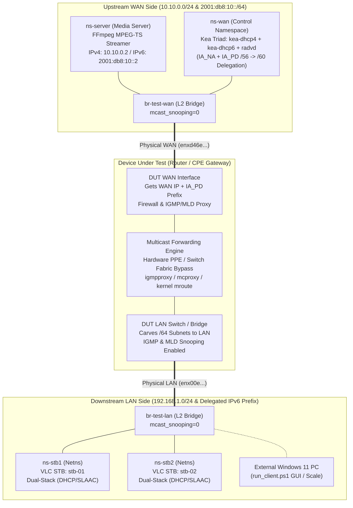

# Real IPTV Multicast Integration Lab

[](#deployment-modes-matrix)
[%20%2B%20IPv6%20(MLDv2)-green.svg)](#core-capabilities)
[%20%2B%20radvd-orange.svg)](#upstream-wan-carrier-stack)
[](#multicast-benchmark--rfc-verification-suite)
[](#core-capabilities)

A production-grade, reproducible network testbed and automated qualification suite for validating **real-world IPTV multicast streaming** through physical CPE router gateways (DUT) or self-contained virtual simulations.

---

## Core Capabilities

* **Real Application & Protocol Stacks**:
  * **Media Server**: High-rate **FFmpeg** broadcasting 1080p MPEG-TS streams over UDP Multicast (`239.10.10.10:5000` / `[ff0e::10:10:10]:5000` / `[ff15::10:10]:5000`).
  * **STB Clients**: **VLC (cvlc)** and native .NET/Python socket clients generating real IGMPv2 / MLDv2 Join/Leave signaling via kernel `IP_ADD_MEMBERSHIP` / `IPV6_ADD_MEMBERSHIP`.
* **Upstream WAN Carrier Stack (The Kea Triad Standard)**:
  * [`kea-dhcp4`](config/kea/kea-dhcp4.conf.in): Carrier-grade DHCPv4 server managing pools, gateway, subnet, and DNS.
  * [`kea-dhcp6`](config/kea/kea-dhcp6.conf.in): Carrier-grade DHCPv6 server supporting **IA_NA** (WAN IPv6 address) and **IA_PD** (Prefix Delegation pools `/56` $\to$ `/60` per RFC 3633 / RFC 8415) for delegating prefixes to router DUTs, Rapid Commit, and DS-Lite AFTR (Option 64).
  * [`radvd`](config/radvd/radvd.conf.in): Autonomous Router Advertisement daemon with granular RFC 4861 / RFC 8106 flags (`AdvManagedFlag on`, `AdvOtherConfigFlag on`, `AdvAutonomous on/off`, RDNSS).
  * **Automated Fallback**: Automatically falls back to `dnsmasq` if Kea is not installed, guaranteeing zero-friction operation.
* **Dual-Stack Protocol Fidelity**: Concurrent testing of IPv4 IGMPv2 (`239.10.10.10:5000`) and IPv6 MLDv2 (`[ff0e::10:10:10]:5000` or `[ff15::10:10]:5000`).
* **Multi-Device Physical Testbed & Standalone Mode**: Test real hardware routers via physical NICs (`WAN_IF`, `LAN_IF`), or stream directly out of any host interface (e.g. `eno1`) without virtual bridges or namespaces.
* **Windows Client Automation Suite ([`run_client.ps1`](scripts/windows/run_client.ps1))**: One-click Windows Defender Firewall setup, static route injection, single-channel GUI playback, ultra-low RAM 32-channel scale monitor (<15MB RAM), and rapid channel churn benchmarking.
* **Dual-Layer PCAP Compliance Engine ([`verify_compliance.sh`](scripts/verify_compliance.sh))**: Wire-level PCAP validation with ASCII packet timeline, join-to-data latency, ToS/DSCP (`AF41`), and Don't Fragment (`DF=1`) verification.

---

## Architecture & Topologies

### Full End-to-End Dual-Stack Testbed (Physical / Virtual)



### Packet Flow & Protocol Sequence

```mermaid
sequenceDiagram
    autonumber
    actor Tester as Test Runner / CI
    participant Server as Media Server (FFmpeg)
    participant DUT as DUT Gateway (Router)
    participant Client1 as Client 1 (STB 1)
    participant Client2 as Client 2 (STB 2)

    Note over Server,DUT: Phase 1: Continuous Multicast Stream (IPv4: 239.10.10.10 / IPv6: [ff0e::10:10:10])
    Server->>DUT: UDP MPEG-TS Stream (Port 5000, 1316B, TTL 16)
    Note over DUT: DUT drops stream (no downstream LAN members yet)

    Note over Client1,DUT: Phase 2: First Client Joins (STB 1)
    Client1->>DUT: IGMPv2 / MLDv2 Membership Report
    Note over DUT: Snooping maps Client1 port; Proxy proxies Join to WAN
    DUT->>Server: Upstream Report (Source IP NATed to WAN IP)
    DUT->>Client1: Forwarded MPEG-TS Video Stream (Hardware Bypass)

    Note over Client2,DUT: Phase 3: Second Client Joins Same Stream (STB 2)
    Client2->>DUT: IGMPv2 / MLDv2 Membership Report
    Note over DUT: Hardware fabric duplicates stream to Client2 port (Upstream Join suppressed)
    DUT->>Client1: Forwarded MPEG-TS Stream
    DUT->>Client2: Forwarded MPEG-TS Stream

    Note over Client1,DUT: Phase 4: Client 1 Leaves (Zapping)
    Client1->>DUT: IGMPv2 Leave / MLDv2 Done
    DUT->>Client1: Stops stream to Client 1
    DUT->>Client2: Stream continues uninterrupted to Client 2 (Fast Leave Isolation)

    Note over Client2,DUT: Phase 5: Client 2 Leaves
    Client2->>DUT: IGMPv2 Leave / MLDv2 Done
    DUT->>Server: Upstream Leave (Forwarding terminated)
```

---

## Deployment Modes Matrix

| Mode | Command | Bridges | Namespaces | Physical NICs | Typical Use Case |
| :--- | :--- | :--- | :--- | :--- | :--- |
| **Standalone Direct Server** *(Zero Topology)* | `sudo ./scripts/start_server.sh -i <iface> -6 start`<br>*(or `--dual`)* | None | None | `eno1` or `WAN_IF` | Linux PC acts directly as IPTV Headend on physical port without bridges or netns. |
| **WAN-Only Testbed** | `sudo ./scripts/setup.sh -s -w --dual` | `br-test-wan` | `ns-server`, `ns-wan` | `WAN_IF` only | Full Upstream WAN environment (Kea Triad + Media Server) connected to router WAN; clients connect to router LAN/Wi-Fi. |
| **Physical Server-Only** | `sudo ./scripts/setup.sh -p -s --dual` | `br-test-wan`, `br-test-lan` | `ns-server`, `ns-wan` | `WAN_IF` & `LAN_IF` | Router in middle; external physical PCs or Windows clients connected to LAN bridge. |
| **Full Physical DUT** | `sudo ./scripts/setup.sh -p --dual --clients 5` | `br-test-wan`, `br-test-lan` | `ns-server`, `ns-wan`, `ns-stb1..5` | `WAN_IF` & `LAN_IF` | Automated qualification with internal STB client namespaces emulating realistic subscribers. |
| **Virtual Simulation** | `sudo ./scripts/setup.sh --virtual --dual` | `br-test-wan`, `br-test-lan` | `ns-server`, `ns-dut`, `ns-stb1..2` | None | Headless CI/CD pipelines, protocol development, and offline debugging. |

---

## Quick Start Guide

### Step 1: Install Dependencies & Pre-flight Diagnostics

```bash
# 1. Install system packages (iproute2, ffmpeg, vlc, tshark, kea, radvd, dnsmasq):
sudo ./scripts/install_deps.sh

# 2. Run non-destructive pre-flight environment check:
./scripts/diagnose.sh
```

### Step 2: Configure Environment (`config.env`)

```bash
cp config.env.example config.env
nano config.env
```
Key settings:
```bash
WAN_IF="enxd46e0e0c65e1"      # Connected to DUT Router WAN port
LAN_IF="enx00e04c88293c"      # Connected to DUT Router LAN port (for dual-bridge modes)
IP_VERSION="dual"             # "4" (IPv4), "6" (IPv6), or "dual" (Concurrent Dual-Stack)
WAN_DHCP_BACKEND="kea"         # 'kea' (Kea Triad: kea-dhcp4 + kea-dhcp6 + radvd) or 'dnsmasq'
```

### Step 3: Generate Video Asset

```bash
# Generate standard 1080p 8Mbps MPEG-TS sample:
./scripts/generate_media.sh

# (Optional) Generate 32 distinct animated channels for scale testing:
./scripts/generate_media.sh -n 32 --preset-low -d 120
```

### Step 4: Launch Testbed Topology

Choose your desired operational mode:

```bash
# Option A: Full WAN Testbed (Dual-Stack: Kea Triad + Background Streaming):
sudo ./scripts/setup.sh -s -w --dual

# Option B: Direct Physical Interface Streaming (Zero Topology):
sudo ./scripts/start_server.sh -i enx6c1ff76608e2 -6 start

# Option C: Full Physical Testbed with 5 Emulated STB Clients:
sudo ./scripts/setup.sh -p --dual --clients 5

# Option D: Virtual Simulation (No physical hardware required):
sudo ./scripts/setup.sh --virtual --dual
```

Inspect active runtime daemons, bridge ports, and IP leases anytime:
```bash
./scripts/show_state.sh
```

### Step 5: Start Client Playback & Stream Reception

#### External Windows Client ([`scripts/windows/run_client.ps1`](scripts/windows/run_client.ps1))
```powershell
# 1. One-click Setup (Opens Firewall UDP 5000 & Adds Multicast Routes):
powershell -ExecutionPolicy Bypass -File .\scripts\windows\run_client.ps1 Setup

# 2. Watch Channel 1 (IPv6) via FFplay / VLC:
powershell -ExecutionPolicy Bypass -File .\scripts\windows\run_client.ps1 Play 1 -IPv6

# 3. 32-Channel Scale & Bitrate Monitor (<15MB RAM):
powershell -ExecutionPolicy Bypass -File .\scripts\windows\run_client.ps1 Scale -Count 32 -IPv6

# 4. Stop all playback:
powershell -ExecutionPolicy Bypass -File .\scripts\windows\run_client.ps1 Stop
```

#### Linux Client ([`scripts/start_client.sh`](scripts/start_client.sh))
```bash
# Run Client 1 interactively in foreground:
sudo ./scripts/start_client.sh --dual 1 run

# Start Client 1 as background daemon:
sudo ./scripts/start_client.sh --dual 1 start

# Check client reception & membership:
./scripts/start_client.sh all status
```

### Step 6: Automated Verification & Evidence Audit

```bash
# Run automated compliance audit on the latest PCAP:
./scripts/verify_compliance.sh
```

Example compliance report output:
```text
==============================================================================
               IPTV MULTICAST LAB - DUAL-LAYER COMPLIANCE AUDIT               
==============================================================================
PCAP File:       captures/lan_20260923_080000.pcap
Multicast Group: 239.10.10.10:5000 / [ff0e::10:10:10]:5000

--- [ LAYER 1: WIRE-LEVEL PACKET INSPECTION (PCAP) ] ---
  [PASS] [WIRE-01] PCAP File Exists & Non-Empty (Size: 18.2 MB)
  [PASS] [WIRE-02] IGMPv2 / MLDv2 Membership Reports (Join detected)
  [PASS] [WIRE-03] MPEG-TS Multicast Video Packets (14,280 frames received)
  [PASS] [WIRE-04] Join-to-Data Latency: 2.450 ms (Threshold: 500 ms)
  [PASS] [WIRE-05] IGMPv2 Leave / MLDv2 Done Signaling
  [INFO] [WIRE-06] IP Header ToS/DSCP: AF41 (0x88)
  [INFO] [WIRE-07] IP Header Don't Fragment (DF) Flag Set: 100%

--- [ LAYER 2: APPLICATION & RUNTIME STATE AUDIT ] ---
  [PASS] [STATE-01] Streaming Process Audit: Clean execution
  [PASS] [STATE-02] Stale Process Check: Zero orphaned daemons

==============================================================================
COMPLIANCE SUMMARY: 7 passed, 0 failed (Total: 7 evaluated)
OVERALL STATUS: PASS
==============================================================================
```

### Step 7: Teardown & Physical Interface Restoration

```bash
# Teardown lab, stop all daemons, and restore physical NICs to UP + DHCP:
sudo ./scripts/cleanup.sh

# Complete teardown AND purge runtime logs and captures:
sudo ./scripts/cleanup.sh --all
```

---

## Documentation & Deep-Dive Guides

| Guide | Description |
| :--- | :--- |
| **[`docs/MANUAL_TEST_GUIDE.md`](docs/MANUAL_TEST_GUIDE.md)** | **Physical Testbed Verification Guide**: 7 Standard Test Cases for router qualification (Hardware bypass, $\le 10\text{ms}$ zapping latency, snooping isolation, fast leave, querier protection, 32-ch scale, 24h stability). |
| **[`docs/IPTV_IPV6_MULTICAST_SETUP_GUIDE.md`](docs/IPTV_IPV6_MULTICAST_SETUP_GUIDE.md)** | **IPv6 Multicast Guide**: Dedicated guide covering IPv6 multicast with FFmpeg, Linux `table local` routing rules, Windows IPv6 socket caveats, and auto-scripts. |
| **[`docs/TROUBLESHOOTING.md`](docs/TROUBLESHOOTING.md)** | **Troubleshooting Runbook**: Hardware gotchas, MTU adaptation, packet loss diagnostics, and NetworkManager conflicts. |
| **[`docs/TEST_PLAN.md`](docs/TEST_PLAN.md)** | **Test Plan & Matrix**: Formal requirement mapping (**R1–R22**) and pass/fail criteria. |
| **[`docs/SHELL_STYLE.md`](docs/SHELL_STYLE.md)** | **Shell Scripting Guidelines**: Strict mode (`set -Eeuo pipefail`), non-root CLI standards, and safety traps. |

---

## Directory & Script Structure

```text
iptv_multicast_integration_lab/
├── config.env.example        # Configuration environment template
├── config.env                # Local host environment configuration
├── config/
│   ├── kea/
│   │   ├── kea-dhcp4.conf.in # Standard Kea DHCPv4 configuration template
│   │   └── kea-dhcp6.conf.in # Standard Kea DHCPv6 configuration template (IA_NA + IA_PD /56 -> /60)
│   ├── radvd/
│   │   └── radvd.conf.in     # Standard Router Advertisement daemon template
│   └── pimd.conf             # PIM-SM/SSM daemon configuration template
├── captures/                 # Timestamped PCAP evidence captures (*.pcap)
├── logs/                     # Daemon logs (server.log, kea-dhcp*.log, radvd.log, etc.)
├── media/                    # MPEG-TS video assets (sample_1080p_8mbps.ts, channel_*.ts)
├── state/                    # Runtime state (PID files, lease files, rendered configs)
├── docs/                     # Specialized guides (Manual Test Guide, IPv6 Guide, Troubleshooting)
├── tools/                    # Standalone Python 3 Multicast & IGMP tools
│   ├── igmp_client.py        # High-performance multi-group join/leave/churn client
│   ├── igmp_query.py         # Raw AF_PACKET IGMP query injector (General & Specific)
│   ├── mcast_sender.py       # Sequence-tagged UDP multicast transmitter
│   └── mcast_receiver.py     # UDP receiver with sequence & loss analysis
└── scripts/
    ├── lib/
    │   ├── common.sh         # Core framework library (Kea Triad, netns, logging, safety)
    │   └── udhcpc.script     # Namespace-safe DHCP event script
    ├── install_deps.sh       # One-touch host dependency installer
    ├── setup.sh              # Topology setup (--physical, --virtual, --wan-only, --dual, -s)
    ├── cleanup.sh            # Idempotent teardown & NIC restoration
    ├── show_state.sh         # Real-time state observer with stale PID detection
    ├── capture.sh            # Packet capture lifecycle manager (tcpdump-based)
    ├── start_server.sh       # Streamer manager (--direct host mode or --netns mode)
    ├── start_client.sh       # Client manager (run | start | stop | status)
    ├── generate_media.sh     # High-precision MPEG-TS asset generator
    ├── diagnose.sh           # Pre-flight host & interface diagnostic tool
    ├── scenario.sh           # Modular automated scenario runner
    ├── verify_compliance.sh  # Dual-layer compliance verification engine
    ├── benchmark_suite.sh    # Benchmark suite runner (quality, stability, scale, churn, stress)
    └── windows/
        ├── run_client.ps1    # Complete Windows automation suite (v2.1 Dual-Stack)
        └── run_client.bat    # Interactive launcher menu for Windows
```

---

## Multicast Benchmark & RFC Verification Suite

Evaluate router forwarding limits, RFC 4541 snooping conformance, and RFC 4605 proxy behavior:

```bash
# Execute full automated benchmark suite:
sudo ./scripts/benchmark_suite.sh all

# Or run specific benchmarks individually:
sudo ./scripts/benchmark_suite.sh quality     # Multi-client throughput, jitter & zero loss
sudo ./scripts/benchmark_suite.sh stability   # Fast Leave isolation & zapping soak
sudo ./scripts/benchmark_suite.sh scale       # 32 concurrent multicast groups capacity
sudo ./scripts/benchmark_suite.sh churn       # Rapid Join/Leave churn (100ms cycles)
sudo ./scripts/benchmark_suite.sh stress      # 250 qps Group-Specific Query stress flood
sudo ./scripts/benchmark_suite.sh querier     # Foreign rogue LAN querier defense
sudo ./scripts/benchmark_suite.sh diagnostics # Remote router state & MDB table dump
```

---

## Wireshark / TShark Display Filters

```text
# All IGMP / MLD Control Signaling:
igmp or icmp6

# IGMPv2 Join (Report):
igmp.type == 0x16

# IGMPv2 Leave:
igmp.type == 0x17

# MLDv2 Report:
icmp6.type == 143

# MLD Query:
icmp6.type == 130

# MPEG-TS Multicast Video Data:
(ip.dst == 239.10.10.10 || ipv6.dst == ff0e::10:10:10 || ipv6.dst == ff15::10:10) && udp.dstport == 5000
```

---

## Top 3 Gotchas & Quick Fixes

1. **Linux Server Multicast goes out Wi-Fi instead of Test Interface**:
   * *Cause*: Linux queries `table local` before `table main`. Default `ff00::/8` routes in `table local` send traffic to the default adapter.
   * *Fix*: Always add multicast route to `table local`:
     ```bash
     sudo ip -6 route replace ff15::/16 dev <TARGET_IF> table local
     ```
2. **Windows Client Receives No Multicast Packets**:
   * *Cause*: Windows Defender Firewall blocks UDP 5000 by default, or multihomed Windows routes IGMP over Wi-Fi.
   * *Fix*: Run [`scripts/windows/run_client.ps1`](scripts/windows/run_client.ps1) with `-Mode Setup` as Administrator.
3. **Video Artifacts / PES Packet Size Mismatch**:
   * *Cause*: MTU mismatch causes IP fragmentation. Routers often drop fragmented UDP packets.
   * *Fix*: Set `pkt_size=1128` (6 TS packets) on Server if interface MTU is $< 1344$ (e.g. MTU 1280), or set interface MTU to 1500 (`sudo ip link set dev <IFACE> mtu 1500`).
