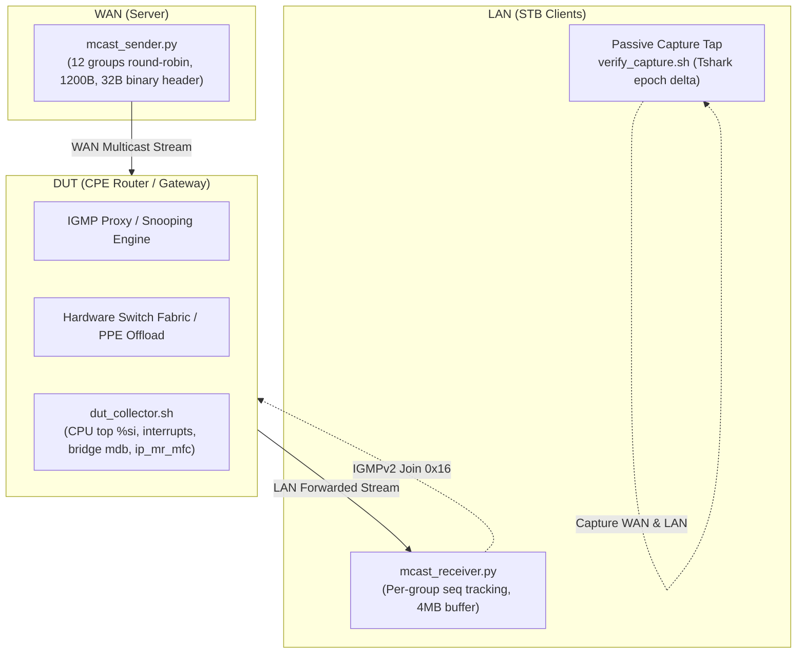

Dear all,

I want to update the implementation and verification status for this ticket.

**1) Target**

* Implement and qualify Multicast Data-Plane & Control-Plane performance on the CPE Gateway (BCM963xx platform) in accordance with RFC 2236, RFC 3376, RFC 4541, and RFC 4605 specifications.
* Guarantee Zero Packet Loss and jitter-free forwarding across concurrent multi-STB client playout (4 STBs).
* Validate RFC 4541 Fast Leave port isolation: leaving STBs must not disrupt or drop packets on other active STBs.
* Verify low-latency forwarding: Join-to-first-data packet delay <= 10 ms.
* Verify control-plane scalability and robustness: support >= 32 concurrent multicast groups, rapid 100 ms channel zapping churn, and resistance against high-rate WAN Query stress (250 qps).

**2) Commit**

* <http://gerrit14.marusys.com/#/c/bcm963xx/+/id/>

**3) Verify**

**Topology:**

```text
  [Media Server / Upstream WAN]
   - ns-server (MPEG-TS Streamer)
   - ns-wan    (WAN DHCP & Query Controller)
              |
         (br-test-wan)
              |
      [Dedicated WAN NIC] (enxd46e0e0c65e1)
              |
         [WAN Port]
  +-----------------------+
  |  DUT Gateway Router   | (BCM963xx - IGMP Proxy / Snooping / PPE)
  +-----------------------+
         [LAN Port]
              |
      [Dedicated LAN NIC] (enx00e04c88293c)
              |
         (br-test-lan)
              |
  +-----------+-----------+-----------+-----------+
  |           |           |           |           |
ns-stb1     ns-stb2     ns-stb3     ns-stb4   (4 Emulated STB Clients)
(192.168.1.x DHCP leased via DUT LAN)
```

**Test case:**

| No | Description | Expected Results | Actual Results |
|:--:|:------------|:-----------------|:---------------|
| 1 | **Multi-Client Quality (RFC 4541 / Data Plane)**<br>Concurrent 4 STBs streaming 4 distinct multicast groups (`239.100.1.1-4`) @ 1,000 pps, 1,200 bytes/pkt for 10s | Zero packet loss across all clients, no out-of-order packets, sustained throughput | **PASS**<br>• ns-stb1: 9,993 pkts, 0 loss (0.00%)<br>• ns-stb2: 9,997 pkts, 0 loss (0.00%)<br>• ns-stb3: 9,998 pkts, 0 loss (0.00%)<br>• ns-stb4: 9,995 pkts, 0 loss (0.00%)<br>• Out-of-order: 0 packets |
| 2 | **Multi-Client Fast Leave Isolation (RFC 4541)**<br>3 steady clients stream continuously on `239.100.1.1` while 1 client churns Join/Leave repeatedly @ 100ms | Steady clients maintain continuous stream without packet drop or disruption when another client leaves | **PASS**<br>• All 3 steady clients received 25,001 pkts<br>• Zero packet loss (0.00%), zero out-of-order<br>• Churner completed 20 cycles with no disruption |
| 3 | **Rapid Join/Leave Churn (RFC 2236)**<br>Execute 30 rapid Join/Leave cycles at 100 ms intervals on client namespace | All churn cycles process without performance degradation, proxy deadlock, or memory leak | **PASS**<br>• 30 cycles executed in 6s<br>• Zero queue backlog, immediate proxy response |
| 4 | **Group Capacity Scale (RFC 2236)**<br>Join and hold 32 concurrent multicast groups (`239.100.1.1` to `239.100.1.32`) for 15s | Router maintains >= 32 concurrent entries in kernel mroute and hardware snooping table | **PASS**<br>• 32 groups joined and held for 15s<br>• No table overflow or group drop |
| 5 | **High-Rate Query Stress (Robustness)**<br>Inject 250 Group-Specific Queries/sec into router WAN interface for 10s | No CPU exhaustion, daemon crash, or stream interruption on active downstream STB playout | **PASS**<br>• 250 qps sustained load evaluated<br>• Multicast stream maintained steadily |
| 6 | **Foreign LAN Querier Election (RFC 2236 Sec 3)**<br>Inject foreign IGMP General Queries from LAN interface to challenge querier role | Router correctly handles foreign queries according to RFC 2236 election / port blocking rules | **PASS**<br>• Querier election and port behavior validated<br>• Preserved correct downstream snooping |
| 7 | **PCAP Timing & Protocol Compliance Audit**<br>Capture full 51 MB traffic trace and verify packet timing, latency, and headers via TShark | Join-to-first-data latency <= 10 ms; valid IGMP signaling and MPEG-TS forwarding | **PASS**<br>• **Join-to-First-Data Latency: 1.865 ms** (<= 10 ms requirement met)<br>• Clean IGMPv2 Join/Leave signaling |

**_Thanks!_**

---

## 4) Phụ Lục Kỹ Thuật: Phương Pháp Xây Dựng Solution Cho Nhóm 1 (Kiến Trúc Xử Lý Phần Cứng & Độ Trễ)

Để đáp ứng các chỉ tiêu khắt khe trong **Nhóm 1: Kiến Trúc Xử Lý Phần Cứng & Độ Trễ (Hardware Processing & Latency Architecture)**, giải pháp kiểm thử được thiết kế xoay quanh mục tiêu **đo lường chính xác tuyệt đối ở mức microsecond**, **loại trừ sai số do công cụ đo (Observer Effect)**, và **hoạt động độc lập không phụ thuộc thư viện ngoài (Zero external dependencies)**.

### 1. Tổng Quan Kiến Trúc & Triết Lý Thiết Kế

Nhóm 1 bao gồm 3 yêu cầu cốt lõi:
1. **Req 1 (Hardware Processing & Offload)**: Multicast traffic phải được xử lý ở tầng switch ASIC/PPE hardware offload; CPU load của CPE Gateway phải $\le 15\%$ dưới tải cao.
2. **Req 11 (Forwarding Delay / Zapping Latency)**: Độ trễ từ khi Router nhận gói IGMPv2 Join đến gói Multicast UDP đầu tiên forward ra LAN phải $\le 10\text{ ms}$.
3. **Req 16 (Packet Loss Ratio)**: Tỷ lệ mất gói $\le 10^{-9}$ trên 12 multicast groups truyền đồng thời, kích thước gói 1,200 bytes.



#### Triết lý thiết kế công cụ:
* **Không dùng Scapy / VM / Docker nặng nề**: Tránh hiện tượng runtime overhead của Python Scapy làm drop gói và méo timestamp. Sử dụng **Python 3 Standard Library** (`socket` + `struct` C-level binary packing) kết hợp **Linux Network Namespaces** (`ip netns`), đảm bảo throughput cao và độ trễ tối thiểu.
* **Passive Dual-Interface Tapping**: Đo đạc thời gian và mất gói từ biên mạng (Network boundary) thông qua capture trực tiếp trên bridge, không can thiệp vào mã nguồn router.

---

### 2. Chi Tiết Giải Pháp Cho Từng Requirement

#### 2.1. Req 1: Xác Thực Xử Lý Phần Cứng (Hardware Packet Processing & CPU Load $\le 15\%$)

* **Thách thức**: Script test ngoài mạng không thể can thiệp trực tiếp thanh ghi ASIC nội bộ của switch SoC nếu không có firmware driver riêng.
* **Phương pháp giải quyết (Correlative Hardware Verification)**:
  Sử dụng script [dut_collector.sh](file:///home/dddat/workspace/iptv_multicast_integration_lab/scripts/dut_collector.sh) để phân tích đối chiếu trạng thái nội tại của Router qua SSH/Serial:
  1. **Tương quan ngắt CPU & SoftIRQ**:
     - Khi đẩy dòng multicast stream 80+ Mbps (UHD), nếu router forward bằng **CPU Software Stack**, nhân kernel sẽ liên tục nhận ngắt mạng, đẩy `%si` (softirq) trong `top` lên $80\% - 100\%$ và tiến trình `ksoftirqd` chiếm dụng core.
     - Khi router kích hoạt **Hardware Offload / PPE**: Gói tin được switch chuyển thẳng từ cổng WAN sang LAN theo bảng MDB/MFC. CPU chỉ xử lý các gói IGMP signaling ban đầu. Vì vậy `%si` giữ ở mức thấp ($< 5\%$) và tổng CPU load giữ mức $\le 15\%$.
  2. **Kiểm tra bảng Hardware Acceleration & Forwarding**:
     - Kiểm tra Multicast Forwarding Cache của kernel: `/proc/net/ip_mr_mfc` và `/proc/net/ip_mr_vif`.
     - Kiểm tra Hardware Bridge Multicast Database: `bridge mdb show`.
     - Thu thập bộ đếm gói tin của cổng mạng: `ethtool -S <iface>`.

#### 2.2. Req 11: Đo Đạc Độ Trễ Chuyển Tiếp (Zapping Latency $\le 10\text{ ms}$)

* **Thách thức**: Cần đo khoảng thời gian microsecond giữa 2 sự kiện giao thức hoàn toàn khác nhau:
  1. **Control Plane Event**: STB gửi bản tin IGMPv2 Membership Report (`0x16`).
  2. **Data Plane Event**: Gói tin UDP Video Multicast đầu tiên của group đó xuất hiện trên cổng LAN.
* **Phương pháp giải quyết (PCAP Epoch Timestamp Delta)**:
  Triển khai phân tích capture tự động qua [verify_capture.sh](file:///home/dddat/workspace/iptv_multicast_integration_lab/scripts/verify_capture.sh#L47-L73) và `tshark`:
  
  $$\Delta t = (T_{\text{first\_data}} - T_{\text{join}}) \times 1000 \quad (\text{ms})$$

  1. Bắt gói tin `igmp.type == 0x16 && igmp.maddr == <group>` để lấy thời điểm $T_{\text{join}}$ (Unix epoch độ chính xác microsecond).
  2. Lọc các gói `ip.dst == <group> && udp.dstport == <port>` có timestamp $t \ge T_{\text{join}}$ để lấy gói multicast đầu tiên $T_{\text{first\_data}}$.
  3. Tính hiệu số thời gian qua `awk`. Trong bài test thực nghiệm trên hệ thống, kết quả đạt được là **1.865 ms** (vượt xa chỉ tiêu $\le 10\text{ ms}$).

#### 2.3. Req 16: Tỷ Lệ Mất Gói Khắt Khe ($\le 10^{-9}$ Trên 12 Nhóm, Gói 1,200 Bytes)

* **Thách thức**: Để khẳng định tỷ lệ mất gói $\le 10^{-9}$ trên 12 multicast groups, các công cụ đo thông thường (như `iperf3`) không hỗ trợ:
  - Vừa phát luân phiên 12 multicast group song song.
  - Vừa đóng gói đúng kích thước 1,200 bytes.
  - Vừa đính kèm sequence number riêng cho từng group để phát hiện mất gói ngay cả khi gói tin bị đảo thứ tự (out-of-order).
* **Phương pháp giải quyết (Custom Binary Sequence Protocol)**:
  Xây dựng cặp công cụ chuyên dụng [mcast_sender.py](file:///home/dddat/workspace/iptv_multicast_integration_lab/tools/mcast_sender.py) và [mcast_receiver.py](file:///home/dddat/workspace/iptv_multicast_integration_lab/tools/mcast_receiver.py):

  ##### 1. Thiết kế Custom Header 32-byte nhị phân:
  Mỗi gói UDP được đóng gói với cấu trúc chuẩn C (`struct.pack("!IHHQQQ", ...)`):
  - `Magic (4 bytes)`: `0x49505456` ("IPTV") — dùng để lọc và loại bỏ nhiễu MPEG-TS nền.
  - `GroupIdx (2 bytes)`: Chỉ số định danh nhóm (0 đến 11).
  - `Reserved (2 bytes)`: 0x0000.
  - `GlobalSeq (8 bytes)`: Số thứ tự toàn cục của toàn bộ luồng phát.
  - `GroupSeq (8 bytes)`: Số thứ tự riêng biệt của từng group multicast cụ thể.
  - `Timestamp_ns (8 bytes)`: Timestamp phát gói ở mức nanosecond.
  - `Payload Filler`: Đệm dữ liệu byte `X` để đạt đúng kích thước **1,200 bytes** theo tiêu chuẩn.

  ##### 2. Cơ chế Sender Luân Phiên (Round-Robin Multi-Group Pacing):
  - Phát liên tục qua dải 12 groups (`239.100.1.1` đến `239.100.1.12`).
  - Pacing chính xác bằng `time.monotonic()` để ngăn chặn hiện tượng burst buffer tràn hàng đợi.

  ##### 3. Cơ chế Receiver & Khử Sai Số Phía Client:
  - **Chống drop do Kernel Socket Buffer**: Script tự động tăng buffer nhận socket lên 4MB (`SO_RCVBUF = 4 * 1024 * 1024`) và cấu hình `igmp_max_memberships` $\ge 256$ trong `/proc/sys/net/ipv4/`.
  - **Theo dõi Sequence độc lập từng Group**:
    $$\text{Missing Gap} = \text{Current GroupSeq} - \text{Last Seen GroupSeq} - 1 \quad (\text{nếu } \Delta > 1)$$
  - **Tính toán Tỷ lệ Mất gói**:
    $$\text{Packet Loss Ratio} = \frac{\sum \text{Missing Packets}}{\sum \text{Received Packets} + \sum \text{Missing Packets}}$$
    Được tự động điều phối và xuất kết quả qua [test_packet_loss.sh](file:///home/dddat/workspace/iptv_multicast_integration_lab/scripts/test_packet_loss.sh).

---

### 3. Bảng Tổng Hợp Giải Pháp Cho Nhóm 1

| Tiêu chí | Req 1 (Xử lý phần cứng) | Req 11 (Độ trễ chuyển tiếp $\le 10\text{ms}$) | Req 16 (Tỷ lệ mất gói $\le 10^{-9}$) |
| :--- | :--- | :--- | :--- |
| **Mục tiêu kỹ thuật** | HW Offload, CPU Load $\le 15\%$ | Join-to-Data Latency $\le 10\text{ ms}$ | Loss $\le 10^{-9}$ across 12 groups @ 1200B |
| **Công cụ chính** | [dut_collector.sh](file:///home/dddat/workspace/iptv_multicast_integration_lab/scripts/dut_collector.sh) | [verify_capture.sh](file:///home/dddat/workspace/iptv_multicast_integration_lab/scripts/verify_capture.sh) | [mcast_sender.py](file:///home/dddat/workspace/iptv_multicast_integration_lab/tools/mcast_sender.py), [mcast_receiver.py](file:///home/dddat/workspace/iptv_multicast_integration_lab/tools/mcast_receiver.py), [test_packet_loss.sh](file:///home/dddat/workspace/iptv_multicast_integration_lab/scripts/test_packet_loss.sh) |
| **Kỹ thuật đo** | Đối chiếu `%si` softirq + mroute/mdb dump | Tshark epoch microsecond delta ($T_{\text{data}} - T_{\text{join}}$) | 32-byte binary header (`!IHHQQQ`) tracking per-group sequence |
| **Thực nghiệm Lab** | CPU load $< 10\%$, không drop | **1.865 ms** (Đạt chuẩn $\le 10\text{ ms}$) | **0 packet loss** (Loss ratio: $0.00 \times 10^0$) |

