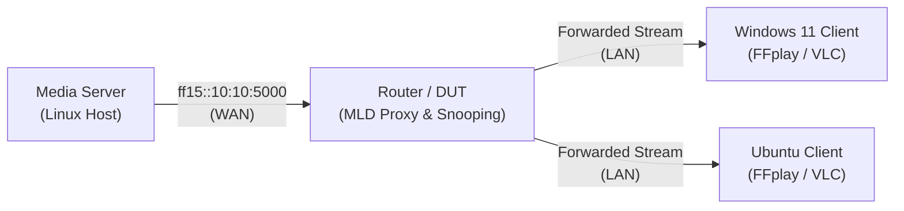

# IPTV IPv6 Multicast Setup & Streaming Guide

A concise, step-by-step practical guide to configure and stream **IPv6 Multicast IPTV** using **FFmpeg** on a physical or virtual testbed.

---

## Architecture & Parameters



| Component | Default Configuration |
| :--- | :--- |
| **Multicast Group** | `ff15::10:10` (Port `5000`, UDP) |
| **Stream Profile** | 1080p H.264 / AAC, MPEG-TS, ~8 Mbps (`pkt_size=1316`, `ttl=16`) |
| **Sample Media** | `media/sample_1080p_8mbps.ts` |
| **Signaling** | MLDv2 (ICMPv6 Type 143 Report, Type 130 Query) |

---

## Step 1: Media Server Setup (Linux)

### 1.1. Prepare Interface & Multicast Route
Linux queries `table local` before `table main`. If your system has multiple active interfaces (e.g. Ethernet + Wi-Fi), multicast routes in `table main` may be ignored. Always assign the route to **`table local`**:

```bash
# Set your target WAN interface (e.g. eno1, enx6c1ff76608e2, eth0)
TARGET_IF="enx6c1ff76608e2"

# 1. Bring interface up with multicast enabled
sudo ip link set dev "${TARGET_IF}" up multicast on

# 2. Add route in table local (forces kernel to send ff15::/16 out TARGET_IF)
sudo ip -6 route replace ff15::/16 dev "${TARGET_IF}" table local

# 3. Verify route lookup (must show TARGET_IF in table local)
ip -6 route get ff15::10:10
```

### 1.2. Transmit Multicast Stream with FFmpeg

```bash
# Get global IPv6 of the interface
LOCAL_IP=$(ip -6 -o addr show dev "${TARGET_IF}" scope global | awk '{print $4}' | cut -d/ -f1 | head -n1)

# Stream in real-time (-re) with MPEG-TS packet packing (7 * 188 = 1316B)
ffmpeg -hide_banner -re -stream_loop -1 \
  -i "media/sample_1080p_8mbps.ts" \
  -c copy -f mpegts \
  "udp://[ff15::10:10]:5000?pkt_size=1316&ttl=16&localaddr=${LOCAL_IP}"
```

> [!TIP]
> - **Why `pkt_size=1316`?** Exactly 7 TS packets (1316B) + 8B UDP + 40B IPv6 = **1364 bytes**, staying well below standard MTU 1500 to prevent fragmentation.
> - **Why `-re`?** Mandates real-time rate reading. Without it, FFmpeg floods the socket at disk speed.

To run as a **background daemon**:
```bash
nohup ffmpeg -hide_banner -re -stream_loop -1 -i "media/sample_1080p_8mbps.ts" \
  -c copy -f mpegts "udp://[ff15::10:10]:5000?pkt_size=1316&ttl=16&localaddr=${LOCAL_IP}" \
  > logs/server_ipv6.log 2>&1 &
echo $! > state/server_ipv6.pid
```

---

## Step 2: Router / DUT Configuration

For the DUT router (e.g. OpenWrt, Linux gateway, or commercial CPE) to forward multicast from WAN to LAN:

1. **MLD Snooping**: Enable on the LAN bridge (`br-lan` / `br0`) to prevent flooding unjoined LAN ports.
2. **MLD Proxy (`mcproxy` / `mldproxy`)**:
   - **Upstream interface**: WAN (connected to Media Server).
   - **Downstream interface**: LAN (connected to Clients).
3. **Firewall Rules**: Allow incoming traffic on WAN:
   - **ICMPv6**: Types `130` (Multicast Listener Query) and `143` (MLDv2 Report).
   - **UDP**: Destination port `5000` to group `ff15::10:10`.

---

## Step 3: Client Playback

### 3.1. Windows Client (PowerShell as Administrator)

> [!CAUTION]
> **Do NOT use `localaddr=` in FFplay on Windows for IPv6!** Winsock expects an interface index for IPv6 multicast joins; string IP binding will fail or reject packets.

```powershell
# 1. Add multicast route pointing to your LAN adapter (run once)
netsh interface ipv6 add route ff15::/16 "Ethernet" metric=1

# 2. Play with FFplay:
ffplay -window_title "IPTV IPv6" "udp://[ff15::10:10]:5000?buffer_size=1048576"

# Or play with VLC: Open URL -> udp://@[ff15::10:10]:5000
```

Verify group membership while playing:
```powershell
netsh interface ipv6 show joins "Ethernet"
```

---

### 3.2. Ubuntu / Linux Client

```bash
# 1. Enlarge UDP socket receive buffer (prevents packet drop bursts)
sudo sysctl -w net.core.rmem_max=16777216 net.core.rmem_default=4194304

# 2. Route multicast to LAN NIC (e.g., eno1)
sudo ip -6 route replace ff00::/8 dev eno1 metric 100

# 3. Play with FFplay (with buffer protection)
ffplay -window_title "IPTV IPv6" \
  "udp://[ff15::10:10]:5000?buffer_size=4194304&overrun_nonfatal=1&fifo_size=500000"
```

---

## Step 4: Quick Verification & Troubleshooting

### Diagnostic Cheatsheet

| Task | Command |
| :--- | :--- |
| **Verify Server Route** | `ip -6 route get ff15::10:10` |
| **Capture Multicast UDP** | `sudo tcpdump -nn -i <IFACE> "ip6 and udp port 5000"` |
| **Capture MLD Signaling** | `sudo tcpdump -nn -i <IFACE> "icmp6 and (ip6[40] == 130 or ip6[40] == 143)"` |
| **Check Linux Group Joins** | `ip maddr show dev <IFACE>` |
| **Check Windows Group Joins**| `netsh interface ipv6 show joins` |

### Common Issues & Quick Fixes

1. **`0 packets captured` on Server interface**:
   - *Cause*: Linux routed multicast out of Wi-Fi or another interface in `table local`.
   - *Fix*: `sudo ip -6 route replace ff15::/16 dev "${TARGET_IF}" table local`
2. **Windows player fails to receive stream**:
   - *Cause*: `localaddr` was specified in FFplay URL or route is missing.
   - *Fix*: Remove `localaddr=...` from URL; run `netsh interface ipv6 add route ff15::/16 "<NIC_NAME>" metric=1`.
3. **Player shows `PES packet size mismatch` / artifacts on startup**:
   - *Initial 1–2s*: Normal behavior while awaiting the first IDR/I-Frame keyframe.
   - *Persistent drops*: Lower packet size (`pkt_size=1128`) on Server or increase client `buffer_size=4194304`.
