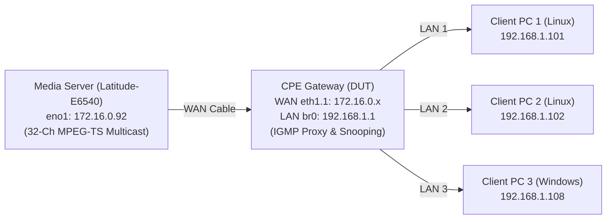

# IPTV Multicast Integration Lab — Physical Testbed Verification Guide

A concise, step-by-step manual test guide for validating CPE Router Gateways (Broadcom/Linux-based DUT) against carrier IPTV multicast requirements (**R1–R22**, consolidated into **7 Test Cases**).

---

## 1. Testbed Architecture & Addressing



| Node | Interface | IP Address | Subnet / Role |
| :--- | :--- | :--- | :--- |
| **Server Host** | `eno1` (or `enx...`) | `172.16.0.92` | Upstream WAN Headend Network |
| **DUT Router WAN** | `eth1.1` | `172.16.0.x` | CPE WAN (Default route to Server) |
| **DUT Router LAN** | `br0` | `192.168.1.1` | LAN Gateway, DHCP Server & IGMP Querier |
| **Client PCs (1..3)**| Physical LAN Ports | `192.168.1.10x` | STB Receivers / Scale & Churn Testers |

> [!IMPORTANT]
> **MTU & Packet Size:** If `eno1` MTU is `1280`, use `pkt_size=1128` (6 TS packets = 1,128B + UDP/IP headers $\le 1280$). If MTU is `1500`, use standard `pkt_size=1316` (7 TS packets).

---

## 2. Pre-Requisites & Quick Setup

### 2.1. Generate Media Assets
```bash
# 1. Standard single 1080p channel (media/sample_1080p_8mbps.ts):
./scripts/generate_media.sh

# 2. (Optional) Generate 32 distinct animated channels for scale testing:
./scripts/generate_media.sh -n 32 --preset-low -d 120
```

### 2.2. Windows Client Setup (Run once as Administrator)
```powershell
# Open firewall port 5000 and inject multicast routes (224.0.0.0/4 & ff00::/8):
powershell -ExecutionPolicy Bypass -File .\scripts\windows\run_client.ps1 -Mode Setup
```

---

## 3. The 7 Standard Test Cases

### TC 1: Hardware Forwarding, Multi-STB Quality & Zero CPU Overhead
* **Target Requirements:** `[R1, R2, R16, R17]`
* **Objective:** Confirm multicast packets bypass the CPU via hardware acceleration (PPE/Switch fabric) under multi-STB load ($\le 10^{-9}$ packet loss).

1. **Server:** Start multicast transmitter:
   ```bash
   ffmpeg -hide_banner -re -stream_loop -1 -i media/sample_1080p_8mbps.ts -c copy -f mpegts \
     "udp://239.10.10.10:5000?pkt_size=1128&ttl=16&localaddr=172.16.0.92"
   ```
2. **Clients (PC 1..3):** Play stream simultaneously:
   * *Linux:* `ffplay "udp://239.10.10.10:5000?buffer_size=4194304"`
   * *Windows:* `.\scripts\windows\run_client.ps1 -Mode Play -Channel 1`
3. **DUT Router (SSH):** Verify CPU load and hardware bypass:
   ```sh
   top -n 1                                 # Verify: %si < 1% and %idle > 90%
   tcpdump -i br0 -n -c 10 "udp port 5000"  # Verify: 0 packets captured on CPU bridge
   ```
* **PASS Criteria:** Clients play video smoothly; Router CPU `%si < 1%`; `tcpdump` on `br0` captures 0 packets.

---

### TC 2: Channel Zapping Latency ($\le 10\text{ ms}$)
* **Target Requirements:** `[R1, R12]`
* **Objective:** Measure time between IGMPv2 Join transmission and arrival of first data packet.

1. **Client PC 1:** Start background packet capture:
   ```bash
   sudo tcpdump -i eth0 -n -s0 -w /tmp/zap.pcap "igmp or (udp and port 5000)" &
   CAP_PID=$!
   ```
2. **Client PC 1:** Trigger join and stop capture:
   ```bash
   timeout 3 ffplay -nodisp -vn -an "udp://239.10.10.10:5000"
   kill -INT $CAP_PID
   ```
3. **Client PC 1:** Calculate microsecond delta using `tshark`:
   ```bash
   t0=$(tshark -r /tmp/zap.pcap -Y "igmp.type == 0x16" -T fields -e frame.time_epoch | head -n1)
   t1=$(tshark -r /tmp/zap.pcap -Y "udp.dstport == 5000" -T fields -e frame.time_epoch | head -n1)
   awk -v t0="$t0" -v t1="$t1" 'BEGIN { printf "Zapping Latency: %.3f ms\n", (t1 - t0) * 1000 }'
   ```
* **PASS Criteria:** Measured zapping latency is **$\le 10.0\text{ ms}$** (typically 1.5–3.0 ms).

---

### TC 3: IGMP Proxy, Header Rewriting & L2 Snooping Isolation
* **Target Requirements:** `[R1, R3, R4, R5, R7, R8, R19]`
* **Objective:** Verify router rewrites Source IP/MAC on WAN, marks DSCP `AF41` (`0x88`), sets `DF=1`, and confines multicast packets strictly to joined ports.

1. **Server:** Capture upstream IGMP signaling:
   ```bash
   sudo tcpdump -i eno1 -n -c 5 -v "igmp"
   ```
2. **Client PC 1:** Start viewing channel: `ffplay "udp://239.10.10.10:5000"`
3. **Server:** Verify captured IGMPv2 Report:
   * **Source IP**: Matches Router WAN IP (`172.16.0.x`), **not** client IP (`192.168.1.x`).
   * **QoS**: Displays `tos 0x88` (DSCP 34 / AF41) and `flags [DF]`.
4. **DUT Router (SSH):** Check hardware snooping table:
   ```sh
   bridge mdb show   # Verify: Only port connected to PC 1 is listed
   ```
* **PASS Criteria:** Upstream report carries Router WAN IP, ToS `0x88`, `DF=1`; `bridge mdb` lists only active client port.

---

### TC 4: Multi-STB Tracking & Fast Leave Isolation
* **Target Requirements:** `[R1, R10, R13]`
* **Objective:** Verify a leaving client does not disrupt concurrent viewers on the same multicast group.

1. **Client PC 1 & PC 2:** Open live stream on `239.10.10.10`:
   ```bash
   ffplay -v error "udp://239.10.10.10:5000?buffer_size=4194304"
   ```
2. **Client PC 3:** Execute 20 rapid Join/Leave churn cycles (100 ms interval):
   * *Windows:* `.\scripts\windows\run_client.ps1 -Mode Churn -Count 1 -Cycles 20 -DelayMs 100`
   * *Linux:*
     ```bash
     for i in {1..20}; do
       timeout 0.5 ffplay -nodisp "udp://239.10.10.10:5000" 2>/dev/null &
       sleep 0.1; killall -9 ffplay 2>/dev/null; sleep 0.1
     done
     ```
3. **DUT Router (SSH):** Monitor snooping table: `bridge mdb show`
* **PASS Criteria:** PC 1 & PC 2 playback continues smoothly with **0 frame drops and 0 artifacts** during all 20 churn cycles.

---

### TC 5: Querier Role & Rogue Querier Protection
* **Target Requirements:** `[R6, R14]`
* **Objective:** Verify router acts as Querier on LAN, Proxy Reporter on WAN, and ignores rogue LAN queriers.

1. **DUT Router (SSH):** Check IGMP role state:
   ```sh
   cat /proc/net/igmp
   # Verify: eth1.1 (WAN) has 'Reporter: 1'; br0 (LAN) has 'Querier: V2'
   ```
2. **Client PC (LAN):** Verify downstream Query source IP:
   ```bash
   sudo tcpdump -i eth0 -n -v "igmp and ip[9] == 2"   # Must show Router LAN IP (192.168.1.1)
   ```
3. **Client PC (LAN):** Inject rogue query with lower IP (`192.168.1.254`):
   ```bash
   sudo python3 tools/igmp_query.py --interface eth0 --group 0.0.0.0 --src-ip 192.168.1.254
   ```
4. **DUT Router (SSH):** Re-check `cat /proc/net/igmp`: Router must **remain Querier**.
* **PASS Criteria:** Router maintains Querier authority; downstream queries originate from `192.168.1.1`.

---

### TC 6: Scale (32 Channels), 100ms Churn & 250 qps Query Stress
* **Target Requirements:** `[R9, R11, R18]`
* **Objective:** Verify router supports $\ge 32$ concurrent multicast groups, handles rapid channel zapping, and withstands a 250 qps query flood.

1. **Server:** Stream 32 multicast groups concurrently:
   ```bash
   OUT=""
   for i in {1..32}; do OUT="$OUT -c copy -f mpegts udp://239.100.1.$i:5000?pkt_size=1128&ttl=16&localaddr=172.16.0.92"; done
   ffmpeg -hide_banner -re -stream_loop -1 -i media/sample_1080p_8mbps.ts $OUT
   ```
2. **Clients:** Join all 32 groups:
   * *Windows (Ultra-low RAM socket engine):*
     ```powershell
     powershell -ExecutionPolicy Bypass -File .\scripts\windows\run_client.ps1 -Mode Scale -Count 32
     ```
   * *Windows GUI Video Grid:*
     ```powershell
     powershell -ExecutionPolicy Bypass -File .\scripts\windows\run_client.ps1 -Mode ScaleGUI -Count 4
     ```
   * *Linux:* `python3 tools/igmp_client.py --interface-ip 192.168.1.101 --groups 239.100.1.1-32 --hold-sec 600`
3. **Server:** Inject 250 qps Specific Query stress on WAN:
   ```bash
   sudo python3 tools/igmp_query.py --interface eno1 --group 239.10.10.10 --rate-pps 250 --duration-sec 10
   ```
4. **DUT Router (SSH):** Verify capacity & CPU:
   ```sh
   bridge mdb show | grep -c "239.100.1."   # Verify: Returns 32
   cat /proc/net/ip_mr_mfc | wc -l          # Verify: >= 32 cache entries
   top -n 1                                 # Verify: CPU < 15%
   ```
* **PASS Criteria:** Router maintains 32 concurrent active groups in hardware MDB; CPU remains $< 15\%$; zero drops.

---

### TC 7: 24h Stability & Boot DHCP Concurrency
* **Target Requirements:** `[R15, R20, R21, R22]`
* **Objective:** Verify router allocates DHCP leases immediately during reboot under active multicast load, and operates stably for 24h without memory leaks.

1. Keep 32-channel multicast transmission active on Server WAN.
2. Reboot the Router DUT.
3. Once booted, verify clients receive DHCP IP leases in $< 2.0$ seconds:
   ```sh
   # On Router DUT:
   cat /tmp/dhcp.leases 2>/dev/null || cat /var/lib/misc/dnsmasq.leases
   ```
* **PASS Criteria:** All client MACs obtain valid `192.168.1.x` leases immediately during boot despite continuous multicast traffic.

---

## 4. Teardown & Post-Test Cleanup

```bash
# On Server Host:
killall ffmpeg 2>/dev/null || true

# On Linux Clients:
killall ffplay python3 2>/dev/null || true

# On Windows Client:
powershell -ExecutionPolicy Bypass -File .\scripts\windows\run_client.ps1 -Mode Stop

# On Router DUT:
bridge mdb show   # Verify all entries clear back to idle
```

---

## 5. Top 3 Gotchas & Quick Fixes

1. **Windows Client shows black screen / no packets received:**
   * *Fix:* Run `.\scripts\windows\run_client.ps1 -Mode Setup` (opens Firewall UDP 5000 & adds `224.0.0.0/4` route to Ethernet adapter).
2. **Video exhibits pixelation, stuttering, or `PES packet size mismatch`:**
   * *Fix:* Router MTU mismatch. Use `pkt_size=1128` on Server (or set `sudo ip link set dev eno1 mtu 1500`). Add `buffer_size=4194304` to client player.
3. **PowerShell script errors with `ParserError: Variable reference is not valid (':')`:**
   * *Fix:* In PowerShell string interpolation, write `${group}:${Port}` instead of `$group:$Port`.
